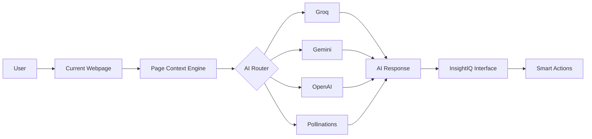

<div align="center">

# 🚀 InsightIQ

### AI Browser Assistant for Smarter Browsing

<p align="center">

Transform any webpage into an intelligent workspace with contextual AI, smart browser actions, document analysis, and multi-provider AI support.

</p>

<p align="center">


</p>

<p align="center">

<a href="#demo">🎥 Demo</a>
•
<a href="#screenshots">📸 Screenshots</a>
•
<a href="#features">✨ Features</a>
•
<a href="#installation">⚙ Installation</a>
•
<a href="#tech-stack">🛠 Tech Stack</a>

</p>

</div>

---

# 📖 Overview

InsightIQ is an AI-powered Chrome Extension that transforms everyday web browsing into an intelligent, interactive experience.

Instead of switching between browser tabs and AI chat applications, users can communicate directly with the webpage they are currently viewing.

The extension understands page context, answers questions, summarizes content, extracts key insights, analyzes uploaded files, performs safe browser actions, and generates AI-powered images—all within a modern browser interface.

Designed for students, developers, researchers, and professionals, InsightIQ streamlines learning, research, and productivity without disrupting the browsing workflow.

---

# ❓ Why InsightIQ?

Traditional AI workflows require users to:

- Copy webpage content
- Switch to another AI application
- Paste content
- Ask questions
- Return to the browser

InsightIQ eliminates this entire workflow by bringing AI directly into the browser.

Users remain focused on their work while receiving intelligent, context-aware assistance exactly where they need it.

---

# ✨ Features

| Feature | Description |
|---------|-------------|
| 🧠 AI Page Understanding | Reads and understands the current webpage |
| 💬 Contextual AI Chat | Ask questions about the current page |
| 📑 Smart Summaries | Instant summaries and key points |
| ⚡ Smart Browser Actions | AI-assisted browser interactions with user confirmation |
| 📂 File Analysis | Analyze PDF, DOCX, TXT, and CSV files |
| 🖼 AI Image Generation | Generate images from text prompts |
| 🖼 Image Analysis | Understand uploaded images |
| 🤖 Multiple AI Providers | Groq, Gemini, and OpenAI |
| 💾 Chat History | Save, rename, export, and import conversations |
| 🌙 Modern UI | Side Panel, Compact Popup, Dark & Light Mode |

---
# 📸 Screenshots

A quick overview of InsightIQ in action.

<table>
<tr>

<td align="center" width="50%">

### 🏠 Home


Modern side panel with quick actions and page context.

</td>

<td align="center" width="50%">

### 📄 AI Page Summary


Summarize any webpage with AI-powered insights.

</td>

</tr>

<tr>

<td align="center" width="50%">

### 💻 Developer Documentation


Understand technical documentation with AI.

</td>

<td align="center" width="50%">

### 📂 File Analysis


Analyze documents and extract key insights.

</td>

</tr>

<tr>

<td align="center" width="50%">

### 💬 Chat History


Manage and export previous conversations.

</td>

<td align="center" width="50%">

### ⚙️ Settings


Configure AI providers and personalize the extension.

</td>

</tr>

</table>

---
# 🎥 Demo

Watch InsightIQ in action.

> 📹 **Demo Video:** *(Add your YouTube or Google Drive link here)*

The demo showcases:

- AI-powered webpage understanding
- Smart browser actions
- Multi-provider AI routing
- File analysis
- Image generation
- Side Panel workflow
- Compact Popup experience

---

# 🏗️ Architecture



---

# 🔄 AI Routing

InsightIQ intelligently routes every request to the appropriate AI provider.

| Task | Provider |
|------|----------|
| 💬 Normal Chat | Selected AI Provider |
| 📄 Page Summary | Selected AI Provider |
| 📑 Key Points | Selected AI Provider |
| 📂 File Analysis | Selected AI Provider |
| 🖼️ Image Analysis | Gemini |
| 🎨 Image Generation | Pollinations AI |

This automatic routing removes the need for manual provider switching and provides a seamless user experience.

---

# 🚀 How It Works

```text
Open a webpage
        │
        ▼
Launch InsightIQ
        │
        ▼
Capture webpage context
        │
        ▼
Ask a question
        │
        ▼
AI Provider Router
        │
        ▼
Generate intelligent response
        │
        ▼
Display answer
        │
        ▼
(Optional)
Execute Smart Actions
```

---

# 🌟 Why Choose InsightIQ?

✅ Context-aware AI assistance

✅ No copy-paste workflow

✅ Multiple AI providers

✅ Smart browser automation

✅ Professional Side Panel interface

✅ AI-powered file understanding

✅ Privacy-first architecture

✅ Modern React + TypeScript application

---

# ⚙️ Installation

## 1. Clone the Repository

```bash
git clone https://github.com/asimaashraf/InsightIQ.git
```

## 2. Navigate to the Project

```bash
cd InsightIQ
```

## 3. Install Dependencies

```bash
npm install
```

## 4. Build the Extension

```bash
npm run build
```

---

# 🌐 Load the Extension

After building the project:

1. Open Google Chrome

2. Navigate to

```text
chrome://extensions
```

3. Enable **Developer Mode**

4. Click **Load unpacked**

5. Select the generated **dist** folder

6. Pin **InsightIQ** from the Chrome toolbar

You're ready to use InsightIQ 🚀

---

# 🔑 AI Provider Setup

InsightIQ supports multiple AI providers.

Open:

**Settings → AI Providers**

Add your preferred API key.

Supported providers:

| Provider | Supported |
|----------|-----------|
| 🟢 Groq | ✅ |
| 🔵 Gemini | ✅ |
| ⚫ OpenAI | ✅ |

### Intelligent Routing

InsightIQ automatically selects the correct provider depending on the requested task.

| Request | Provider |
|----------|----------|
| AI Chat | Selected Provider |
| Page Summary | Selected Provider |
| Explain Page | Selected Provider |
| File Analysis | Selected Provider |
| Image Analysis | Gemini |
| Image Generation | Pollinations AI |

No manual switching is required.

---

# 🛠️ Tech Stack

| Category | Technology |
|----------|------------|
| Frontend | React 19 |
| Language | TypeScript |
| Build Tool | Vite |
| Browser | Chrome Extension Manifest V3 |
| Storage | Chrome Storage API |
| AI Providers | Groq • Gemini • OpenAI |
| Image Generation | Pollinations AI |
| Markdown | DOMPurify |
| PDF Export | html2canvas + jsPDF |
| Document Parsing | Mammoth |

---

# 📂 Project Structure

```text
InsightIQ
│
├── public
│   ├── icons
│   └── manifest.json
│
├── src
│   ├── actions
│   ├── background
│   ├── components
│   ├── content
│   ├── popup
│   ├── sidepanel
│   ├── services
│   ├── utils
│   └── types
│
├── screenshots
│
├── README.md
├── package.json
├── vite.config.ts
├── tsconfig.json
├── .env.example
└── LICENSE
```

---

# 🔒 Privacy & Security

Privacy is a core design principle of InsightIQ.

✅ No developer API keys are included.

✅ Users securely manage their own API keys.

✅ Browser actions always require explicit confirmation.

✅ No analytics or user tracking.

✅ No browsing history is stored.

✅ No personal information is collected.

---

# 🧪 Testing

The extension was tested across multiple real-world browsing scenarios.

### Functional Testing

- ✅ Context-aware AI Chat
- ✅ Page Summaries
- ✅ Key Point Extraction
- ✅ Explain Page
- ✅ Smart Browser Actions
- ✅ File Analysis
- ✅ Image Analysis
- ✅ Image Generation
- ✅ Chat History
- ✅ Import / Export
- ✅ Side Panel
- ✅ Compact Popup
- ✅ Dark Mode
- ✅ Light Mode

---

# 📈 Performance

InsightIQ is optimized for speed and responsiveness.

Highlights:

- ⚡ Fast page context extraction
- ⚡ Optimized React rendering
- ⚡ Efficient Chrome Storage usage
- ⚡ Lightweight production build
- ⚡ Modern Vite bundling

---

# 🌍 Browser Compatibility

| Browser | Status |
|----------|--------|
| Google Chrome | ✅ Fully Supported |
| Microsoft Edge | ✅ Compatible |
| Brave | ✅ Compatible |
| Opera | ✅ Compatible |

---

# 🏆 OpenAI Build Week Submission

InsightIQ was created as part of **OpenAI Build Week 2026**, where developers were challenged to build real-world AI applications using modern AI tools.

The goal of this project was to rethink how people interact with web content by bringing contextual AI directly into the browser instead of forcing users to switch between webpages and external AI chat applications.

InsightIQ demonstrates how AI can become a natural part of everyday browsing while maintaining user control, privacy, and productivity.

---

# 🤖 AI-Assisted Development

AI tools were used throughout the development process to accelerate implementation and improve developer productivity.

### OpenAI GPT-5.5

GPT-5.5 assisted with:

- Brainstorming features
- UI and UX improvements
- Documentation
- Architecture discussions
- Debugging strategies
- Feature planning
- Prompt refinement

---

### OpenAI Codex

Codex accelerated development by assisting with:

- React component implementation
- TypeScript refactoring
- Chrome Extension integration
- Smart Actions workflow
- Provider routing
- Build troubleshooting
- Code organization
- Error handling

---

### GitHub Copilot

GitHub Copilot improved development speed through:

- Code suggestions
- Boilerplate generation
- TypeScript autocompletion
- Utility function generation
- Refactoring repetitive code

---

# 👩‍💻 Human Contribution

While AI tools accelerated development, the project was independently designed, integrated, tested, and finalized by the project author.

The author was responsible for:

- Product vision
- System architecture
- Feature selection
- User experience
- AI workflow integration
- Debugging
- Testing
- Performance validation
- Final implementation
- Documentation review

---

# 🎯 Design Principles

InsightIQ was built around five core principles.

### 🧠 Context First

AI should understand the page before answering.

---

### ⚡ Productivity

Reduce unnecessary tab switching.

---

### 🔒 Privacy

Users remain in control of their own API keys.

---

### 🤝 Safety

Browser actions always require user confirmation.

---

### 🎨 Simplicity

Professional interface with minimal distractions.

---

# 🛣️ Roadmap

Future improvements include:

- 🎙 Voice Conversations
- 🌍 Multi-language Support
- 📷 OCR Document Understanding
- 🧠 Long-term AI Memory
- ☁ Cloud Synchronization
- 📱 Mobile Companion App
- 🌐 Firefox & Edge Store Release
- 🤖 Additional AI Providers
- 📊 Productivity Analytics

---

# 🤝 Contributing

Contributions are welcome.

1. Fork the repository

2. Create a new branch

```bash
git checkout -b feature/amazing-feature
```

3. Commit changes

```bash
git commit -m "Add amazing feature"
```

4. Push

```bash
git push origin feature/amazing-feature
```

5. Open a Pull Request

---

# 📄 License

This project is licensed under the **MIT License**.

See the LICENSE file for additional information.

---

# 👩‍💻 Developer

**Asima Ashraf**

AI Engineer • MERN Stack Developer • Machine Learning Enthusiast

📍 Pakistan

### Connect with me

- GitHub: https://github.com/asimaashraf
- LinkedIn: *(Add your LinkedIn profile here)*
- Email: aasimaashraf899@gmail.com

---

# ⭐ Support

If you found this project useful, please consider giving it a ⭐ on GitHub.

Your support helps improve the project and encourages future open-source development.

---

<div align="center">

## 🚀 InsightIQ — AI Browser Assistant

**Making the web smarter, one page at a time.**

Built with ❤️ by **Asima Ashraf**

OpenAI Build Week 2026

</div>
